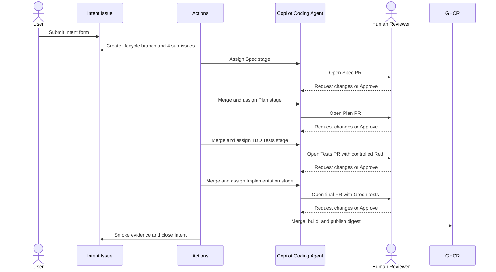

# Brownfield Human-Gated Delivery demo

This demo safely evolves the existing IT service desk from a user Intent into
a reviewed specification, implementation plan, executable tests, working
increment, and verified container image.

```text
Intent -> Spec review -> Plan review -> TDD Red review
       -> Implementation Green review -> Build -> Smoke test -> Feedback
```

Every design and code transition requires a Human approval in the GitHub Web
UI. GitHub Actions assigns reviewers and advances approved stages; Copilot
never approves its own work or bypasses branch rules.

## Lifecycle



The workflow creates `brownfield-delivery/<intent-number>` from `main`. Spec,
Plan, and Tests PRs merge into that lifecycle branch. The Implementation PR
starts from the lifecycle branch and is automatically retargeted to `main`, so
the final PR contains the complete reviewed increment.

## Review artifacts

Each lifecycle stores:

```text
docs/delivery-runs/brownfield-human-gated-delivery/<intent-number>/
  spec.md
  plan.md
  expected-failures.json
```

- `spec.md` contains scope, non-goals, constraints, and stable Given/When/Then
  scenarios such as `AC-1`.
- `plan.md` decomposes the work into stable task IDs, dependencies, affected
  surfaces, validation, and acceptance mappings.
- `expected-failures.json` lists the exact executable tests expected to be Red
  before implementation.

These files are versioned evidence. Later stages may consume them but cannot
silently rewrite an artifact that a Human already approved.

## One-time repository setup

### Enable GitHub features

Enable:

- Copilot Coding Agent;
- Issues and sub-issues;
- pull-request auto-merge;
- GitHub Actions;
- GitHub Packages and GHCR;
- automatic Copilot code review, if available for the repository plan.

Create the `it-service-desk-demo` Environment. It records the final temporary
container verification; it is not a persistent hosting environment.

### Create the Intent label

Create `brownfield-human-gated-delivery:intent` before using the Issue form.
The kickoff workflow creates the internal stage labels automatically.

### Configure the Copilot token

Create a fine-grained user PAT or GitHub App user-to-server token named
`COPILOT_ASSIGN_TOKEN`. GitHub's Copilot assignment API does not accept the
default server-to-server `GITHUB_TOKEN`.

The fine-grained token needs:

- metadata: read;
- actions: read and write;
- contents: read and write;
- issues: read and write;
- pull requests: read and write.

The token is used only by trusted default-branch workflows to assign Copilot
and enable protected auto-merge. It is never exposed to PR-head workflows.
Human review in GitHub Web does not require this token.

### Configure Human reviewers

Edit
[`config.json`](../.github/brownfield-human-gated-delivery/config.json):

```json
{
  "stages": {
    "spec": {
      "minimumApprovals": 1,
      "reviewers": {
        "users": ["huangyingting"],
        "teams": []
      }
    }
  }
}
```

Each stage supports GitHub user logins, organization team slugs, and its own
approval threshold. The checked-in default assigns `huangyingting` and
requires one approval for Spec, Plan, Tests, and Implementation.

Configuration is loaded from the default branch. A pull request cannot assign
friendlier reviewers or reduce its own approval threshold.

### Configure branch rulesets

Create active rulesets for `brownfield-delivery/**` and `main`.

For both:

1. Require a pull request.
2. Require at least one approving review as the repository floor.
3. Dismiss stale approvals when new commits are pushed.
4. Require conversation resolution.
5. Block force pushes.
6. Require the branch to be up to date before merging.
7. Do not grant Copilot a bypass.

Block deletion of `main`. Allow deletion of `brownfield-delivery/**` so
successful delivery can remove its temporary lifecycle branch.

For `brownfield-delivery/**`, require the
**Brownfield Delivery · Stage CI** checks:

- `intake`;
- `classify`;
- `artifact-gate`;
- `tdd-red`;
- `implementation-contract`.

Only the applicable stage job executes; GitHub reports the other routed jobs
as skipped.

For `main`, require:

- all coordinator and Brownfield Delivery checks listed above;
- `validate`;
- `container-smoke`.

The repository ruleset enforces the common floor. The PR Coordinator enforces
any higher stage-specific threshold from
`.github/brownfield-human-gated-delivery/config.json` before enabling
auto-merge.

## Run the demo

### 1. Submit an Intent

Open **Issues > New issue**, choose
**Brownfield human-gated delivery: Submit an intent**, and describe:

- the problem or opportunity;
- the users and stakeholders;
- the desired observable outcome;
- constraints and non-goals;
- success signals.

Do not write the implementation plan. Only Issues created by an `OWNER`,
`MEMBER`, or `COLLABORATOR` can start automation.

The **Brownfield Delivery · Kickoff** workflow creates:

- `brownfield-delivery/<intent-number>`;
- Spec, Plan, TDD Tests, and Implementation sub-issues;
- one progress comment on the parent Intent;
- the initial Copilot Spec assignment.

### 2. Review the Spec

Copilot changes only
`docs/delivery-runs/brownfield-human-gated-delivery/<intent>/spec.md`. CI
checks the required sections, stable acceptance IDs, and Given/When/Then
behavior.

In GitHub Web:

1. Inspect scope, non-goals, edge cases, and acceptance scenarios.
2. Use **Request changes** when behavior is ambiguous or incomplete.
3. Ask Copilot to address the comments.
4. Use **Approve** only when the behavioral contract is acceptable.

After the configured Human approvals and checks are satisfied, GitHub
auto-merges the PR and the workflow assigns the Plan stage.

### 3. Review the Plan

Copilot changes only
`docs/delivery-runs/brownfield-human-gated-delivery/<intent>/plan.md`. CI
verifies:

- every acceptance scenario maps to tasks;
- task IDs and dependencies are valid and acyclic;
- affected surfaces and validation are explicit.

Review feasibility, sequencing, migration risk, and unnecessary complexity.
Approve or request changes through the same GitHub Web review flow.

### 4. Review TDD Red

Copilot adds executable tests and `expected-failures.json` without changing
production code.

The Red gate succeeds only when:

1. the lifecycle base test suite is Green;
2. head lint, type-check, and build succeed;
3. the new tests execute and fail;
4. observed failures match the manifest exactly;
5. there are no unrelated, syntax, environment, or infrastructure failures.

The Actions Job Summary records the exact Red evidence. The Human reviews the
assertions and their mapping to the approved acceptance scenarios, then
Approves or Requests changes.

### 5. Review Implementation Green

Copilot implements the approved task plan without modifying the approved Spec,
Plan, or expected-failure contract. Automation retargets this PR to `main`.

Required checks prove:

- every expected Red test is now Green;
- all existing tests pass;
- lint and production build pass;
- the production container builds;
- `/api/health` and the dashboard smoke test pass.

The Human performs the final code and behavior review. Approval enables
auto-merge only after every required check is Green.

### 6. Observe delivery

The **Brownfield Delivery · Publish** workflow:

1. validates that the merged PR is the lifecycle Implementation stage;
2. builds the merged commit;
3. publishes its SHA tag and immutable digest to GHCR;
4. runs that exact digest in the `it-service-desk-demo` Environment;
5. verifies `/api/health` and the dashboard;
6. writes the digest and Actions run link to the parent Intent.

Success closes the Implementation sub-issue and parent Intent, then deletes
the lifecycle branch. Failure keeps or reopens the Intent and retains the
branch for diagnosis and remediation.

## Recovery and retries

- Re-run **Brownfield Delivery · Kickoff** with an existing Intent number when
  kickoff is interrupted. Branch, sub-issue, comment, and assignment
  operations are idempotent.
- For a failed stage check or requested change, leave PR review comments and
  let Copilot push a correction to the same stage PR. Stale approvals are
  dismissed and Human Review is requested again.
- For delivery infrastructure failures, use GitHub's **Re-run failed jobs**.
  For a code defect discovered after merge, keep the Intent open and submit a
  new remediation Intent; the retained lifecycle branch preserves evidence for
  diagnosis.

## Workflow security

- `pull_request` CI executes PR code with read-only permissions and no secrets.
- `pull_request_target` workflows coordinate APIs only and never checkout the
  PR head.
- Reviewer policy always comes from `main`.
- Copilot and bot reviews never satisfy Human approval counts.
- Closing keywords are forbidden in stage PRs; lifecycle automation owns Issue
  completion.
- Kickoff and transition operations are idempotent so retries do not duplicate
  stage Issues or assignments.

## Local verification

```sh
npm test
npm --prefix demos/it-service-desk test
npm --prefix demos/it-service-desk run lint
npm --prefix demos/it-service-desk run build
docker build -t it-service-desk:local demos/it-service-desk
docker run --rm -p 3000:3000 it-service-desk:local
```

Then check <http://localhost:3000/api/health> and
<http://localhost:3000/>.

This write-enabled Coding Agent lifecycle is separate from the repository's
read-only
[Copilot CLI orchestration demonstrations](./copilot-cli-agent-orchestration-patterns.md).

## References

- [Using Copilot cloud agent via the API](https://docs.github.com/en/copilot/how-tos/use-copilot-agents/cloud-agent/use-cloud-agent-via-the-api)
- [Requesting pull-request reviewers](https://docs.github.com/en/rest/pulls/review-requests)
- [GitHub sub-issues API](https://docs.github.com/en/rest/issues/sub-issues)
- [Managing auto-merge](https://docs.github.com/en/repositories/configuring-branches-and-merges-in-your-repository/configuring-pull-request-merges/managing-auto-merge-for-pull-requests-in-your-repository)
- [Creating repository rulesets](https://docs.github.com/en/repositories/configuring-branches-and-merges-in-your-repository/managing-rulesets/creating-rulesets-for-a-repository)
- [Publishing Docker images](https://docs.github.com/en/actions/tutorials/publish-packages/publish-docker-images)
