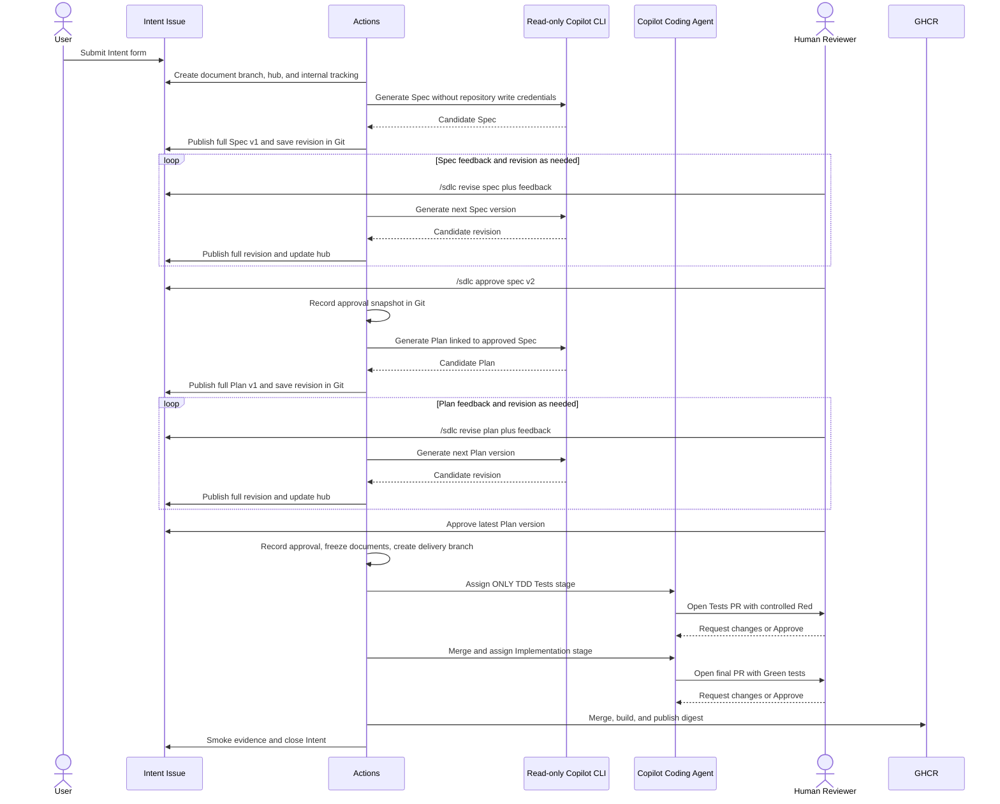

# Brownfield Human-Gated Delivery demo

For a hands-on session, follow the
[step-by-step walkthrough](./brownfield-human-gated-delivery-walkthrough.md).
This page is the setup, policy, and implementation reference.

This demo safely evolves the existing IT service desk from a human-authored Intent into
a reviewed specification, implementation plan, executable tests, working
increment, and verified container image.

```text
Human Intent -> AI Spec <-> Human review and revision
             -> AI Plan <-> Human review and revision
             -> TDD Red review -> Implementation Green review
             -> Build -> Smoke test -> Feedback
```

Every design and code transition requires a Human approval in the GitHub Web
UI. GitHub Actions records document approvals and coordinates protected PR
stages; Copilot never approves its own work or bypasses branch rules.
The Human writes the Intent in a GitHub Issue; there is no AI-written Intent
stage or additional Intent approval gate. For **new Intents**, AI writes the
Spec and Plan as full rendered Markdown revision comments on that same parent
Issue. Humans discuss and explicitly request revisions or approve versions
there before moving to Tests and Implementation PRs.

**Compatibility:** Intents that already have lifecycle branches remain in
[legacy Spec/Plan PR mode](#legacy-specplan-pr-mode). They are not automatically
migrated. The new workflow must be present and registered on the remote default
branch before use; these documentation changes alone do not deploy it.

## Lifecycle



New document reviews use `brownfield-documents/<intent-number>`. Only when the
Plan has all required approvals does automation create
`brownfield-delivery/<intent-number>` **from the approved document commit**,
close the internal Spec/Plan stage issues, and assign only TDD Tests to Coding
Agent. Four stage issues may remain as internal tracking, but the Human's main
review surface before tests is the parent Intent, not those issues or document
PRs.

Tests PRs merge into the delivery branch. The Implementation PR starts from it
and is automatically retargeted to `main`, so the final PR contains the complete
reviewed increment, including the approved document and approval-state blobs.

## Review artifacts

Use the parent Intent's current hub comment to locate the latest Spec and Plan,
their versions, and approval status. Each published revision is a full rendered
Markdown comment, not just a diff, summary, or file link. Revision history,
ordinary discussion, and Human commands stay on that Issue. Git snapshots
provide durable evidence in addition to the readable comments. Checklists
remain reminders, not approval controls.

Each new lifecycle stores these files on `brownfield-documents/<intent-number>`:

```text
docs/delivery-runs/brownfield-human-gated-delivery/<intent-number>/
  spec.md
  plan.md
  document-review.json
```

- `spec.md` contains scope, non-goals, constraints, and stable Given/When/Then
  scenarios such as `AC-1`.
- `plan.md` decomposes the work into stable task IDs, dependencies, affected
  surfaces, validation, and acceptance mappings, and links its approved Spec.
- `document-review.json` records document versions, hashes, processed commands,
  approval snapshots, and handoff state.

Every revision and approval is saved in Git. An approved snapshot records the
reviewed revision's comment ID/body and document version/hash, the approval
command comment, and the Human's ID, login, and approval time. Editing or deleting a
**processed** approval comment does not revoke that recorded decision. To
change an approved document before handoff, submit an explicit revision command;
do not try to revoke approval by changing an old comment.

Each source-state commit also has a digest entry in one collapsible audit-ledger
comment on the parent Issue, maintained by trusted `github-actions[bot]`
automation. Approval provenance is checked against that ledger; directly
editing `document-review.json` in Git cannot impersonate a Human approval.
Do not edit or delete the ledger to change a review decision.

Tests later add `expected-failures.json` in the same artifact directory on the
delivery branch. It lists the exact executable tests expected to be Red before
implementation.

These files are versioned evidence. Later stages may consume them but cannot
silently rewrite an artifact that a Human already approved.
TDD Tests and Implementation must preserve the exact approved `spec.md`,
`plan.md`, and `document-review.json` Git blobs, not merely equivalent prose.
Implementation also preserves every approved test file's Git blob from the
lifecycle branch. Add additional tests in **new files**; do not edit, delete,
rename, or weaken approved tests, even if their test names remain unchanged.

### Issue command contract

Submit each command as a **new top-level Human comment on the parent Intent**,
with the command on its own first line. These are this repository's custom
GitHub Actions commands, **not built-in `@copilot` commands**:

```text
/sdlc revise spec
<feedback describing the requested Spec changes>
```

```text
/sdlc revise plan
<feedback describing the requested Plan changes>
```

```text
/sdlc approve spec v2
```

```text
/sdlc approve plan v1
```

Replace example version numbers with the latest version shown in the hub.
Ordinary discussion, "looks good," checklist edits, and bot comments neither
execute AI nor approve a stage. Editing an old comment is not a new submission.
Revision commands need feedback; use `/sdlc retry` with no feedback to resume
failed generation.

Only a current configured Human with repository write access, including a
current member of a configured team, may approve. Bots cannot. Approvals must
target the latest document version and satisfy that stage's configured
`minimumApprovals`. Issue approval is not a native PR review: GitHub's
independent-review restriction for a person collaborating with Copilot does not
apply, and the Intent author can approve when eligible under configuration.

A Spec revision **before engineering handoff** invalidates all Spec approvals
and the draft or approved Plan, including its approvals. Review and approve the
new Spec, then generate and approve a new Plan version; do not reuse stale Plan
approval. Plan revisions similarly require fresh approvals for that Plan
version. Once the Plan is fully approved, the documents freeze for engineering
handoff; revision commands cannot rewrite that approved contract.

## One-time repository setup

### Run the setup script

Use the dependency-free
[`setup.mjs`](../.github/brownfield-human-gated-delivery/scripts/setup.mjs)
from the repository root. It targets GitHub.com and requires Node.js 24+, GitHub
CLI (`gh`), and an authenticated **repository administrator**. No root `npm
install` is needed. The existing demo automation and application must already
be on `main`, which must be the default branch; setup does not publish local
code or change branch names.

```sh
gh auth login --hostname github.com

# Read-only preview, including configured reviewers and missing prerequisites.
npm run setup:brownfield -- --repo huangyingting/ai-native-sdlc

# Apply missing settings, then read them back to verify.
npm run setup:brownfield -- --repo huangyingting/ai-native-sdlc --apply
```

Replace `huangyingting/ai-native-sdlc` with your repository when using a fork.
The explicit repository argument prevents accidental changes to another remote.
The administrator's CLI credential needs permission to manage repository
settings/rulesets, Actions settings/secrets, Environments, and Issues. This is
**separate from** the limited automation PAT below; do not give that PAT
administration access just to run setup.

The script:

- verifies the configuration, issue form, prompts, validators, workflows, and
  application manifests/Dockerfile exist on `main`, including
  `brownfield-human-gated-delivery-documents.yml` (**Brownfield Delivery ·
  Documents**);
- enables Issues, auto-merge, the configured merge method, and GitHub Actions;
- verifies/registers the Documents workflow for dispatch, enables disabled
  delivery workflows and IT service desk CI, and leaves unrelated workflows
  alone;
- creates the Intent label and temporary verification Environment if missing;
- configures managed rulesets only for `main` and `brownfield-delivery/**`,
  binding required checks to the verified GitHub Actions app identity, with no
  bypass actors; it does not automatically protect an existing unprotected
  `main`;
- checks individual Human reviewers have repository write access, checks for
  an assignable Copilot Bot, and checks the automation secret **name**, never
  its stored value.

By default, existing rulesets and Environment protections are never overwritten.
Compliant, stronger rules are preserved. The explicit `--single-owner` mode
described below changes only the native approval count in existing named
rulesets. All other conflicts in those rulesets stop setup before any writes;
resolve those conflicts in GitHub settings and rerun. Other or
inherited rulesets and classic branch protection may impose additional checks
or prevent lifecycle-branch creation/deletion; inspect those manually. Setup
does not grant bypasses or relax organization policies.

The document branch must permit trusted automation writes; it is not added to
either managed ruleset or given a bypass. Check organization-wide rulesets that
could otherwise prevent those writes. If `main` is currently unprotected,
inspect that state and configure the documented protection separately rather
than treating setup as authorization to change it.

Verify **Actions > Brownfield Delivery · Documents** is available on the remote
default branch. A workflow file in a local checkout is not proof of remote
registration or deployment. Publish the reviewed workflow changes first, then
rerun full setup to verify/register them.

To create or replace the automation secret, first create the PAT using
[the permissions below](#configure-the-copilot-token), then use an interactive
terminal:

```sh
npm run setup:brownfield -- --repo huangyingting/ai-native-sdlc --apply --set-token
```

GitHub CLI prompts securely for the value. Do not put the token in command-line
arguments, files, or chat. Without `--set-token`, an existing secret is untouched.
Secret presence cannot verify its permissions, expiration, selected repository,
or Copilot entitlement.

To repair an already-created Intent's missing label:

```sh
npm run setup:brownfield -- --repo huangyingting/ai-native-sdlc --apply --intent 7
```

This requires an open Issue from an authorized author. It only adds the label;
it does **not** dispatch kickoff. The script prints the explicit resume command
for after setup and manual checks.

Exit codes: **0** means automated checks passed (manual checks still apply),
**2** means previewed changes or unresolved checks remain, and **1** means an
error/conflict. Changes are not transactional: if GitHub rejects a later write,
earlier successful changes remain. Fix the reported error and rerun; resources
are not duplicated, secrets are not rotated implicitly, and applied settings
are read back before success is reported.

Manual steps still include account/organization Copilot access and billing,
PAT creation/authorization, sub-issue availability, GHCR package publication
permissions, and optional automatic Copilot review. Restricted Actions
allowlists and team-based reviewer policies are reported as unverified (exit
2); the script does not expand the allowlist or claim to have validated team
membership using the secret. Configure the intended Human reviewers through a
reviewed change to `main`; setup never changes reviewer identities. Local
application installation is optional and covered by the walkthrough.

Document generation additionally requires the Actions permission
`copilot-requests: write`, Copilot CLI entitlement, and any applicable
organization CLI billing policy. Checking the assignment-token secret does
not verify any of those prerequisites.

### Single-owner demo mode

New Spec/Plan **Issue approvals do not require this mode**: GitHub's native PR
independent-review restriction does not apply to Issue comments. The configured
Human policy and `minimumApprovals` still apply. This option concerns Tests and
Implementation PRs, and legacy Spec/Plan PRs.

GitHub can exclude approvals from people who worked with Copilot on a PR from
its native required-review count, even when the person is the repository owner.
This is separate from the demo's configured Human approval policy. See
[GitHub's Copilot review guidance](https://docs.github.com/en/copilot/how-tos/copilot-on-github/use-copilot-agents/review-copilot-output).
For independent review, add another collaborator with **write access**; they do
not need to be an owner.

For a demo with one Human, opt in explicitly:

```sh
# Preview the single-owner configuration.
npm run setup:brownfield -- --repo huangyingting/ai-native-sdlc --single-owner

# Apply and verify it.
npm run setup:brownfield -- --repo huangyingting/ai-native-sdlc --single-owner --apply
```

This mode sets native `required_approving_review_count` to **0** in managed
rulesets (`main` and lifecycle branches) that setup manages or creates.
Existing rulesets are re-read before updating; only that count is changed.
Branch scope, required status checks and their GitHub Actions source,
conversation resolution, force-push protection, and no-bypass enforcement remain
in place. Unrelated rulesets and Environment protections are untouched.
GitHub's extra-approval setting for unattributed Copilot PRs is left unchanged;
it has no effect when the native required count is zero.

**Do not reduce `minimumApprovals` in the delivery configuration.** Every PR
stage still requires an explicit approval from a configured Human on the
current head SHA through **Brownfield delivery policy**. Document stages use
the latest-version Issue approval snapshot instead. Change requests, stale
approvals, bot reviews, and missing stage checks still block PR advancement.
The coordinator's successful workflow job is not a replacement for this required
policy status.

This is **not independent two-person review**. Ordinary maintenance PRs outside
the delivery lifecycle also lose the native approval floor in these rulesets.
Use the default independent-review mode for repositories requiring separation
between the person directing the agent and the person approving the work.

Keep `--single-owner` on subsequent setup runs. Omitting it reports a mode
conflict instead of silently restoring the native approval floor. Restoring
independent review requires an explicit ruleset edit. Additional or inherited
review requirements can still require another person and are not removed by
this option.

Applying a review-rule change can unblock already-approved PRs with auto-merge
enabled and therefore advance the lifecycle. Setup itself does not submit
approvals or merge PRs. Full setup must also verify/register the Documents
workflow; do not replace it with only a targeted lifecycle-ruleset edit.
An existing unprotected `main` is not changed automatically. Inspect the preview
and configure protection separately if required for your demo.

### Enable GitHub features

Enable:

- Copilot Coding Agent;
- Copilot CLI in Actions, its entitlement/billing policy, and
  `copilot-requests: write` for document generation;
- Issues and sub-issues;
- pull-request auto-merge;
- GitHub Actions;
- GitHub Packages and GHCR;
- automatic Copilot code review, if available for the repository plan.

Create the `it-service-desk-demo` Environment. It records the final temporary
container verification; it is not a persistent hosting environment.

### Create the Intent label

Create `brownfield-human-gated-delivery:intent` before using the Issue form.
The kickoff workflow creates the internal stage labels automatically.
GitHub does not create a missing label from an Issue form: the Issue can be
submitted without it, and kickoff is then skipped. To recover, create the label,
apply it to the existing Intent, and manually run **Brownfield Delivery ·
Kickoff** with that Issue number after completing the remaining setup. Adding
the label alone does not trigger kickoff.

### Configure the Copilot token

Create a fine-grained user PAT or GitHub App user-to-server token named
`COPILOT_ASSIGN_TOKEN`. GitHub's Copilot assignment API does not accept the
default server-to-server `GITHUB_TOKEN`.

The fine-grained token needs:

- metadata: read;
- actions: read and write;
- contents: read and write;
- issues: read and write;
- pull requests: read and write;
- organization members: read, when configuring organization teams.

The token is used only by trusted default-branch automation for operations
such as assigning Copilot, resolving configured team membership, dispatching
workflows, retargeting implementation PRs, and enabling or revoking protected
auto-merge. Retargeting uses this token rather than `GITHUB_TOKEN`, whose edits
suppress the `pull_request: edited` event needed to validate the new base.
The token is never exposed to PR-head workflows.

Document generation does **not** receive this token or other repository write
credentials. Copilot CLI uses its separate Actions access with
`copilot-requests: write` and CLI entitlement. Trusted publication and approval
steps perform Git and Issue writes outside the generation boundary.
Human review in GitHub Web does not require a token.

### Configure Human reviewers

Edit
[`config.json`](../.github/brownfield-human-gated-delivery/config.json):

```json
{
  "stages": {
    "spec": {
      "minimumApprovals": 1,
      "reviewers": {
        "users": ["huangyingting"],
        "teams": []
      }
    }
  }
}
```

Each stage supports GitHub user logins, organization team slugs, and its own
approval threshold. The checked-in default assigns `huangyingting` and
requires one approval for Spec, Plan, Tests, and Implementation.
The Intent author is not implicitly an approver. To make an end user's approval
mandatory for Spec and Plan in this demo, configure that user's GitHub login
as the sole reviewer for those stages with `minimumApprovals: 1`. With a larger
reviewer pool, the threshold can be satisfied by any eligible members of that
pool; it does not require one particular person.

Configuration is loaded from the default branch. A generated document or pull
request cannot assign friendlier reviewers or reduce its own approval threshold.

- **Issue documents:** approve only the latest version, as a current configured
  Human with repository write access, directly configured or a current member
  of a configured team. The Intent author is eligible if configured; bots are
  not. The recorded comment/body, Human identity/time, version, and document hash
  form the approval snapshot. Editing/deleting a processed comment is not a
  revocation mechanism.
- **PR stages (including legacy Spec/Plan):** approvals must be from configured
  users or current configured team members, on the current head SHA, and not
  from the PR author or bots. Comment-only and pending reviews do not replace
  the last decisive review. Dismissals invalidate approvals; configured
  reviewers' outstanding change requests block the policy.

Team membership is read with `COPILOT_ASSIGN_TOKEN`, not the repository-scoped
`GITHUB_TOKEN`; ensure it can read the configured organization teams.

### Configure branch rulesets

Create active rulesets for `brownfield-delivery/**` and `main`.
These are the only managed branch scopes. `brownfield-documents/**` must allow
trusted automation to save document revisions and approval state without a PR;
do not include it in the PR-required delivery ruleset and do not grant it a
bypass. Check broader organization rules for conflicts. An existing unprotected
`main` is not automatically changed by document rollout or setup; protection is
an explicit administrator decision.

For both:

1. Require a pull request.
2. Require at least one approving review as the repository floor by default.
   For [single-owner demo mode](#single-owner-demo-mode), set only the native
   approval count to zero and retain the required Human policy status.
3. Dismiss stale approvals when new commits are pushed.
4. Require conversation resolution.
5. Block force pushes.
6. Require the branch to be up to date before merging.
7. Do not grant Copilot a bypass.

Block deletion of `main`. Allow deletion of `brownfield-delivery/**` so
successful delivery can remove its temporary lifecycle branch.
For the lifecycle-branch ruleset's required status checks, enable
`do_not_enforce_on_create` (do not require status checks on branch creation).
The document handoff must be able to create the lifecycle branch at the approved
document commit before any stage PR exists. Legacy kickoff creates its branch
from `main`. Subsequent updates and merges still require the checks.
Do not add a rule restricting creation of lifecycle branches.

For **both** `brownfield-delivery/**` and `main`, require:

- **`Brownfield delivery policy`** — the exact commit-status context written
  by the trusted PR Coordinator; select GitHub Actions as the expected source.
- **`stage-validation`** — the aggregate **Brownfield Delivery · Stage CI** job.

Do not substitute the coordinator workflow's successful job conclusion for its
policy status. A coordinator can complete successfully while reporting
insufficient approvals. Likewise, do not rely solely on the individually routed
`artifact-gate`, `tdd-red`, or `implementation-contract` jobs: skipped jobs are
not evidence that the applicable stage passed. The aggregate fails if metadata
classification fails or the selected stage does not succeed.

For `main`, require:

- both required status/check names above;
- `validate`;
- `container-smoke`.

The IT service desk CI workflow runs for every PR, without PR-level path filters,
so these required checks also exist for unrelated documentation or tooling PRs.
New Issue document reviews do not run application tests, builds, or container
smoke jobs, and do not wait for PR status checks. Documents validates their
structure, scope, and approval state before advancing.
On legacy lifecycle branches, Spec and Plan skip the application `validate` and
`container-smoke` jobs: their stage CI validates documents and scope, not
application code. Tests also skip normal Green CI and use the dedicated
controlled-Red validation instead.
PRs targeting the default branch always run the real Green checks, even if their
body contains `Delivery Stage: tests` as prose.

| Stage | Automated validation | Human gate |
|---|---|---|
| Spec (new Intent) | Specification structure, acceptance scenarios, document scope/state; no application build | Versioned Issue approval of the latest Spec |
| Plan (new Intent) | Task/dependency structure, acceptance mappings, approved-Spec linkage, document scope/state; no application build | Versioned Issue approval of the latest Plan |
| TDD Tests | Green baseline, compilable test changes, and exact controlled-Red evidence | Review and approve tests |
| Implementation | Immutable contracts, Green tests, lint, build, and container smoke checks | Review and approve implementation |

In default mode, the native review rule enforces a common floor, **not** the
configured reviewer identities or higher stage thresholds. Single-owner demo
mode has no native approval floor and relies on the required policy status for
Human PR-stage approval. New Spec/Plan approvals use the Issue document policy,
not these native PR review rules. The required policy status prevents a
weaker floor from authorizing a manual or automatic merge on its own. Do not grant
humans or automation a ruleset bypass for this demo.

For PR stages, the coordinator writes pending/failure/success on the current
head and revokes existing auto-merge whenever review policy is no longer satisfied. When approvals
are satisfied, it enables protected auto-merge while the required policy status
is still pending, then publishes success; it never directly merges or bypasses
branch rules. It re-reads
live PR metadata and reviews on open/reopen/close, head synchronization, body/base edits,
draft transitions, submitted/edited/dismissed reviews, stage-CI completion, and
default-branch policy configuration changes. These are asynchronous GitHub events;
keep native stale-review dismissal and up-to-date branch requirements enabled.
Coordinator runs are serialized, and **every surviving run reconciles all open
PRs** because GitHub can replace pending runs in a concurrency group. An invalid
PR is failed and its auto-merge revoked without preventing other PRs from being
reconciled; the run reports accumulated failures only after processing the list.
Commit statuses are keyed by **SHA and context**, not PR number. The coordinator
keeps one aggregate `Brownfield delivery policy` status pending until it has
evaluated **every open PR sharing that SHA**. All applicable lifecycle policies
must pass before success; an ordinary PR cannot overwrite a sibling's failure.
All protected auto-merge requests for an approved shared head are enabled while
the aggregate remains pending. A failed decision or mutation revokes auto-merge
for that shared-head group. Unrelated heads are still reconciled independently.
Closing a blocking duplicate PR triggers reconciliation of the remaining peers.
Ordinary non-lifecycle PRs receive a not-applicable success only when no lifecycle
policy on their shared head blocks it. Lifecycle registration
is retained in a PR comment, so deleting body markers instead fails validation.
Do not delete that registration comment.

## Run the demo

### 1. Submit an Intent

Open **Issues > New issue**, choose
**Brownfield human-gated delivery: Submit an intent**. The title and all five
fields are prefilled with an example intent: **Clarify ticket ownership** in
the existing IT service desk. These are editable values, not
placeholder hints, so they are included in the submitted Issue.

The Human reviews or edits the defaults and clicks **Create**. The Intent
describes unclear ownership and handoffs, the desired improvement, affected
users and systems, and constraints. It leaves assignment rules, owner selection,
and filtering as open questions for Spec review rather than dictating the
solution. Detailed acceptance scenarios belong in the Spec; test, build, and
smoke checks are delivery policy, not business intent.

For a different feature, replace the title and all five fields:

- the problem or opportunity;
- the proposed outcome;
- affected users and systems;
- constraints and non-goals;
- open questions.

Do not write the implementation plan. Only Issues created by an `OWNER`,
`MEMBER`, or `COLLABORATOR` can start automation. Complete the
[one-time repository setup](#one-time-repository-setup) first; the prefilled
form does not configure tokens, reviewers, or branch rules. GitHub uses the
Issue form from the default branch, so template changes must be merged there
before they appear under **New issue**.

The Intent title and body are snapshotted when document review starts.
Subsequent changes to that title or body are rejected by the document workflow,
not silently adopted as new requirements. Keep the original Intent unchanged;
provide refinements through explicit revision-command feedback, or submit a
new Intent when the original request itself needs to change.

The **Brownfield Delivery · Kickoff** workflow routes new Intents to
**Brownfield Delivery · Documents**
(`brownfield-human-gated-delivery-documents.yml`). The document workflow uses
`brownfield-documents/<intent-number>`, keeps the current review hub on the
parent Intent, and publishes the first full Spec revision. Spec, Plan, TDD
Tests, and Implementation issues may exist as internal stage tracking; do not
manually assign Spec or Plan to Coding Agent.

Issue document generation uses `spec-issue.md` and `plan-issue.md` under
`.github/brownfield-human-gated-delivery/prompts/`. The original `spec.md` and
`plan.md` prompts remain for legacy PR runs.

There is no delivery branch or engineering assignment for a new Intent until
the Plan is fully approved. Existing Intents with lifecycle branches instead
retain [legacy mode](#legacy-specplan-pr-mode).

### 2. Review the Spec

Read-only Copilot CLI generates the Spec in Actions. Trusted automation
validates the required sections, stable acceptance IDs, Given/When/Then
behavior, and document-only scope, then saves the revision and review state in
Git and publishes its full Markdown on the parent Issue. The Spec must identify
unanswered Intent questions and label proposed decisions for review rather than
presenting them as agreed requirements.

In GitHub Web:

1. Use the parent Intent's hub to find the latest full Spec revision comment.
   Read scope, non-goals, edge cases, acceptance scenarios, and open questions.
2. Discuss uncertainties in ordinary Issue comments as needed. Discussion
   alone neither calls AI nor changes the approval state.
3. To request an actual revision, submit a new top-level comment:

   ```text
   /sdlc revise spec
   Clarify how unassigned tickets work and how existing data is preserved.
   ```

4. Wait for Documents to publish the next version, read it in full, and repeat
   step 3 as needed. Application tests and builds do not run at this stage.
5. When the current version is acceptable, submit its explicit approval:

   ```text
   /sdlc approve spec v2
   ```

   Use `v2` only if it is the current version. Each required Human submits
   their own approval; `minimumApprovals` is not reduced.

After the configured approvals are recorded for the latest Spec, Documents
generates a Plan linked to that approved Spec. No Spec PR or merge is involved.

#### Rules for every review round

- Keep the same parent Intent and document branch for all review rounds.
- Use the explicit `/sdlc` command contract, not an `@copilot` mention or
  incidental prose. Commands must be new top-level submitted Human comments.
- There is no fixed round limit or timeout that grants approval.
- A new version needs fresh approval; only the latest version can be approved.
  A Spec revision before handoff invalidates all Spec approvals and the
  draft/approved Plan, so a new Plan version and approvals are required.
- Comments such as "looks good," checklist changes, and successful generation
  are not approval. A processed approval comment is a saved decision;
  editing/deleting it does not revoke it. Submit a revision before handoff.
- Full Plan approval freezes documents and starts engineering handoff. Do not
  approve the Plan while a Spec change is still needed.
- Commands are a durable queue reconciled on each run, not just the comment
  that triggered the run. Superseded pending runs must not lose submitted
  commands. Rerun/resume after failure instead of creating a replacement Intent.
- Existing Issues without an Open questions field remain valid; no migration
  of earlier human-authored Intents is required.

### 3. Review the Plan

Documents generates and publishes the Plan on the same parent Intent, with a
link to the approved Spec. Validation verifies:

- every acceptance scenario maps to tasks;
- task IDs and dependencies are valid and acyclic;
- affected surfaces and validation are explicit.

Review feasibility, sequencing, migration risk, unnecessary complexity, and
coverage of the approved Spec. To request another version, submit:

```text
/sdlc revise plan
Break the work into dependency-ordered tasks and map each task to acceptance
scenarios and validation. Preserve the approved specification.
```

Read each new full revision. Approve only its latest version, for example
`/sdlc approve plan v1` if no Plan revision was needed. Once all required Human
approvals are recorded, automation freezes `spec.md`, `plan.md`, and
`document-review.json`, creates `brownfield-delivery/<intent>` at the approved
document commit, closes the internal Spec/Plan issues, and assigns **only TDD
Tests** to Coding Agent.

If planning reveals a conflict with the approved Spec, submit `/sdlc revise spec`
with feedback **before full Plan approval**. That explicitly invalidates the
old Spec approvals and Plan. Review the new Spec and then its new Plan version;
the Plan must not silently rewrite approved requirements.

### Legacy Spec/Plan PR mode

Intents that already had `brownfield-delivery/<intent>` lifecycle branches
before the Issue document workflow remain in the existing PR-based lifecycle.
There is **no automatic migration**; resuming an old Intent does not turn it
into a new document review.

For these Intents only, kickoff creates or reuses the lifecycle branch from
`main`, and Coding Agent handles Spec and then Plan in separate document-review
PRs. The parent progress hub links each **Spec review** or **Plan review** PR
and its commit-pinned **Read document** snapshot. Return to the PR's
**Files changed** tab for inline feedback and formal review.

Keep revisions in the same stage PR. Submit **Request changes** and explicitly
ask `@copilot` in that PR to address the feedback, change only that stage's
document, summarize changes/open questions, and wait for re-review. These
legacy `@copilot` loops are separate from the new Issue `/sdlc` commands.
Ordinary discussion does not automatically drive a revision.

Mark the PR ready for review and submit **Approve** on its latest head.
Configured Human approvals, document/scope checks, and protected auto-merge
must all succeed; a closed unmerged PR does not advance. New commits need fresh
approval, and outstanding change requests block policy. Spec and Plan PRs
skip application builds. The coordinator advances to Plan after Spec merges,
then Tests after Plan merges. A later stage must not rewrite an already
approved artifact. Native PR independent-review restrictions and the explicit
single-owner option still apply in this mode.

### 4. Review TDD Red

Copilot adds executable tests and `expected-failures.json` without changing
production code or the approved document/approval-state blobs. Review now moves
from the parent Issue to the Tests PR.

The Red gate succeeds only when:

1. the lifecycle base test suite is Green;
2. head lint, type-check, and build succeed;
3. the new tests execute and fail;
4. observed failures match the manifest exactly;
5. there are no unrelated, syntax, environment, or infrastructure failures.

Validation checks the full Vitest 5 JSON report, including failed suites with
no assertions. A companion reporter records unhandled errors and nested suite
errors omitted by Vitest's JSON reporter. It also tracks Vitest's public
`onHookStart`/`onHookEnd` callbacks: failed or incomplete `beforeEach`/`afterEach`
hooks leave unmatched starts and are rejected even when an expected test name is
reported as failing. Passing hooks around a genuine assertion failure remain
valid Red. Missing, malformed, interrupted, or
inconsistent evidence, duplicate expected test names, and skipped expected tests
are rejected. Scope checks use the PR merge-base diff with rename detection
disabled, so renamed files cannot hide an out-of-scope deletion.

The Actions Job Summary records the exact Red evidence. The Human reviews the
assertions and their mapping to the approved acceptance scenarios, then
Approves or Requests changes.

### 5. Review Implementation Green

Copilot implements the approved task plan without modifying the approved Spec,
Plan, document approval-state blob, expected-failure contract, or approved test
blobs. Automation retargets
this PR to `main`. New test files are allowed alongside implementation changes.

Required checks prove:

- every expected Red test is now Green;
- all existing tests pass;
- lint and production build pass;
- the production container builds;
- `/api/health` and the dashboard smoke test pass.

The Human performs the final code and behavior review. Approval enables
auto-merge only after every required check is Green.

### 6. Observe delivery

The **Brownfield Delivery · Publish** workflow:

1. validates that the merged PR is the lifecycle Implementation stage;
2. builds the merged commit;
3. publishes its SHA tag and immutable digest to GHCR;
4. runs that exact digest in the `it-service-desk-demo` Environment;
5. verifies `/api/health` and the dashboard's stable
   `data-testid="service-desk-dashboard"` marker;
6. writes the digest and Actions run link to the parent Intent.

Success closes the Implementation sub-issue and parent Intent, then deletes
the lifecycle branch. Failure keeps or reopens the Intent and retains the
branch for diagnosis and remediation.
Result comments are updated rather than duplicated on reruns. Closed parents are
allowed only for merged default-branch implementation delivery verification and
reporting; other lifecycle operations retain the open-parent guard. Cleanup can
retry after closing the parent, and an already-absent branch counts as success.
Real deletion errors still fail the job. A failed rerun after successful cleanup
reopens the Intent and restores a remediation branch at the merged commit.

## Recovery and retries

- Re-run **Brownfield Delivery · Kickoff** with an existing Intent number when
  kickoff is interrupted. It routes new Intents to Documents and preserves
  existing legacy lifecycles; branch, tracking-issue, hub, and assignment
  operations are idempotent.
- For failed document generation, fix the reported cause and submit a new
  top-level parent-Issue comment containing only:

  ```text
  /sdlc retry
  ```

  It resumes the failed generation without new feedback. For a different
  requested document change, use `/sdlc revise spec` or `/sdlc revise plan`
  followed by feedback instead.
- Alternatively use **Actions > Brownfield Delivery · Documents > Run
  workflow**, select `main`, and set `issue_number` to the existing parent
  Intent number. This uses the workflow's manual `workflow_dispatch` entry
  point. The equivalent dispatch is:

  ```sh
  gh workflow run brownfield-human-gated-delivery-documents.yml \
    --repo huangyingting/ai-native-sdlc --ref main -f issue_number=7
  ```

  Replace the repository and Issue number for your run. This is an explicit
  resume operation, not something setup silently runs. Rerunning Documents
  reconciles the durable queue of submitted commands and saved state, including
  commands whose original pending run was superseded. Do not repost an
  approval or revision merely because that original run was replaced. Inspect
  the latest hub and run result after recovery.
- If publication, approval recording, or handoff failed, resume Documents for
  that same Intent after fixing the cause. Fully approved documents remain
  frozen even when the engineering assignment needs a retry.
- For a failed PR-stage check or requested change, leave review comments and
  explicitly ask Copilot to push a correction to that same Tests,
  Implementation, or legacy document PR. Stale approvals are dismissed and
  Human Review is requested again.
- For delivery infrastructure failures, use GitHub's **Re-run failed jobs**.
  For a code defect discovered after merge, keep the Intent open and submit a
  new remediation Intent; the retained lifecycle branch preserves evidence for
  diagnosis.

### Document-review troubleshooting

| Symptom | What to check or do |
|---|---|
| Documents is absent from Actions or dispatch is unavailable | Confirm `brownfield-human-gated-delivery-documents.yml` is deployed on remote `main`; rerun full setup to verify/register it. Local files are not deployment evidence |
| Documents rejects an edited Intent | The original title/body were snapshotted at startup. Do not rewrite them or the saved state; use explicit revision-command feedback for refinements, or a new Intent for a changed original request |
| A discussion comment did not run AI | Expected: submit a new top-level `/sdlc revise spec` or `/sdlc revise plan` comment with feedback. `@copilot`, edits, and quoted examples are not the document command interface |
| Generation failed or no revision was published | Inspect the Documents run; verify `copilot-requests: write`, CLI entitlement/billing, and Actions availability. Fix the cause, then use `/sdlc retry` or manual Documents dispatch |
| A queued command's original run was superseded | Resume Documents and inspect its durable queue reconciliation; do not create a second Intent or assume the command was discarded |
| Approval was rejected or did not advance | Check the latest version, configured Human login/team membership, current repository write access, and `minimumApprovals`. Bots and stale-version approvals cannot satisfy the gate |
| Editing/deleting an approval did not revoke it | Processed approvals are Git snapshots. Request an explicit revision before full Plan approval; after handoff, use a new Intent for contract changes |
| Spec revision caused the Plan to disappear or become invalid | Expected: all Spec approvals and the draft/approved Plan are invalidated. Approve the new Spec, then review and approve a new Plan version |
| Trusted publication cannot write the document branch | Inspect rulesets matching `brownfield-documents/**`; allow the required trusted writes without adding bypass actors. Managed PR rulesets cover only `main` and `brownfield-delivery/**` |
| An old Intent still opens Spec/Plan PRs | Expected legacy mode for an existing lifecycle branch; no automatic migration occurs |

## Workflow security

- Documents separates untrusted generation from trusted publication and
  approval. Copilot CLI runs read-only in Actions: no repository write
  credentials, no `COPILOT_ASSIGN_TOKEN`, and no application build. Its
  `copilot-requests: write` permission authorizes model requests, not Git,
  Issue, or PR writes. Generation does not write repository files. Candidate
  documents are validated before trusted API publication writes only `spec.md`,
  `plan.md`, and `document-review.json` in this Intent's artifact directory,
  then publishes full revision comments.
- The initial Intent title/body snapshot and the trusted
  `github-actions[bot]` audit-ledger digest entries bind source-state commits to
  the review process. Edited Intent content is rejected, and a direct Git edit
  of approval JSON is not evidence of an eligible Human decision.
- Human commands, comments, and generated prose do not override trusted
  reviewer configuration, grant write credentials to generation, or become
  approval decisions on their own. Only explicit eligible latest-version
  approvals are saved with their evidence. Recorded decisions survive later
  comment edits/deletions; explicit revision invalidation is the supported
  pre-handoff change path.
- New document reviews use only GitHub Issues, Actions, and Git. They require
  no external service, custom UI, or additional application packages.
- `pull_request` CI executes PR code with read-only permissions and no secrets.
- Stage CI checks out PR artifacts into `pr/` and a separate trusted copy into
  `trusted/`. Validators, reviewer configuration, and the companion reporter are
  selected from one default-branch SHA pinned by classification, never from the
  PR head. Trusted validators load configuration relative to their own source;
  their working directory still points at the PR artifacts under validation.
- `pull_request_target` workflows coordinate APIs only and never checkout the
  PR head.
- Before policy success, the trusted coordinator independently enumerates REST
  PR files and enforces stage boundaries, including `previous_filename` for
  renames. A lifecycle PR cannot change its validator or workflow to bypass CI.
  Incomplete file enumeration (including GitHub's file-list limit), malformed
  rename records, or API failures fail closed. Head, base, and metadata snapshots
  are refreshed before publishing policy success; changed snapshots stay pending.
- Review events run a permissionless **Review Signal** workflow. Its completion
  invokes the default-branch coordinator via `workflow_run`; the coordinator
  re-reads all open PRs and their current reviews using live API data, never artifacts or code from
  the signal run. Stage-CI completion uses the same trusted path. Install both
  workflows on the default branch before enabling the required policy status.
- Reviewer policy always comes from `main`.
- Copilot and bot reviews never satisfy Human approval counts.
- Closing keywords are forbidden in stage PRs; lifecycle automation owns Issue
  completion.
- GitHub can append a `START COPILOT CODING AGENT SUFFIX` block containing
  `Fixes #<stage-issue>` despite the prompt. The trusted coordinator changes
  only that recognized trailing reference to `References #<stage-issue>` after
  validating the Copilot bot author and stage context. It uses the user token
  to trigger body-edited CI and leaves policy pending until the updated PR is
  reconciled. Other closing references, including parent, unrelated, and
  cross-repository Issues, remain rejected.
- Copilot identity checks accept the current REST `Copilot` bot and legacy
  `copilot-swe-agent` bot names. They require a Bot actor type, not a matching
  substring in an arbitrary user's login.
- Kickoff and transition operations are idempotent so retries do not duplicate
  stage Issues or assignments. Documents reconciles its durable command queue
  on every run so pending-run replacement cannot silently drop commands.

## Local verification

```sh
node --test .github/brownfield-human-gated-delivery/tests/core.test.mjs .github/brownfield-human-gated-delivery/tests/github.test.mjs
npm test
npm --prefix demos/it-service-desk test
npm --prefix demos/it-service-desk run lint
npm --prefix demos/it-service-desk run build
docker build -t it-service-desk:local demos/it-service-desk
docker run --rm -p 3000:3000 it-service-desk:local
```

Then check <http://localhost:3000/api/health> and
<http://localhost:3000/>.

The lifecycle suite includes real Vitest reporter fixtures for passing hooks,
controlled assertion Red, failed setup, and failed teardown. These subprocess
tests use the demo's installed Vitest dependency; if it is absent, they explicitly
skip until `npm --prefix demos/it-service-desk ci` has been run. Generated reports
and caches are isolated inside the test scratch directory and removed afterward.

This lifecycle combines read-only Copilot CLI document generation with
write-enabled Coding Agent engineering stages. It is separate from the
repository's read-only
[Copilot CLI orchestration demonstrations](./copilot-cli-agent-orchestration-patterns.md).

## References

- [Using Copilot cloud agent via the API](https://docs.github.com/en/copilot/how-tos/use-copilot-agents/cloud-agent/use-cloud-agent-via-the-api)
- [Requesting pull-request reviewers](https://docs.github.com/en/rest/pulls/review-requests)
- [GitHub sub-issues API](https://docs.github.com/en/rest/issues/sub-issues)
- [Managing auto-merge](https://docs.github.com/en/repositories/configuring-branches-and-merges-in-your-repository/configuring-pull-request-merges/managing-auto-merge-for-pull-requests-in-your-repository)
- [Creating repository rulesets](https://docs.github.com/en/repositories/configuring-branches-and-merges-in-your-repository/managing-rulesets/creating-rulesets-for-a-repository)
- [Publishing Docker images](https://docs.github.com/en/actions/tutorials/publish-packages/publish-docker-images)
